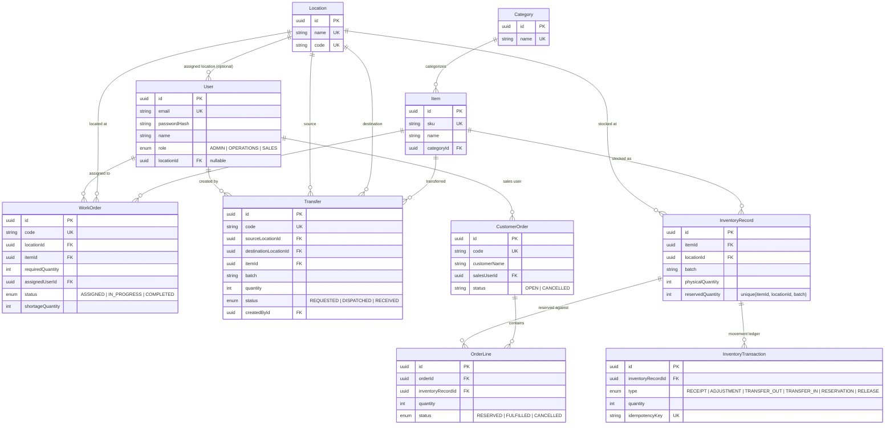

# Database Schema

PostgreSQL, managed with Prisma migrations (`backend/prisma/schema.prisma` +
`backend/prisma/migrations/`). The migration SQL additionally carries a handful of
`CHECK` constraints that Prisma's schema language cannot express natively — see the
note at the bottom.

## ER Diagram

## Key design decisions

- **`InventoryRecord` is the unit of stock**: one row per (item, location, batch),
  enforced by a unique constraint. `availableQuantity` is never stored — it is always
  computed as `physicalQuantity - reservedQuantity`, so it cannot drift out of sync.
- **`InventoryTransaction` is an append-only ledger** of every stock movement
  (receipt, adjustment, transfer out/in, reservation, release), each carrying a unique
  `idempotencyKey`. This is what "prevent duplicate inventory transaction" is built on:
  a retried request with the same key is rejected by the unique constraint.
- **A `CustomerOrder` reserves against one specific `InventoryRecord`** (a specific
  item + location + batch), not against an item in the abstract. See the README
  "Judgment calls" section for why.
- **CHECK constraints as a second line of defense.** Prisma's schema language has no
  native `@@check` attribute, so these are hand-added to the generated migration SQL
  (`backend/prisma/migrations/20260821110611_init/migration.sql`):
  - `InventoryRecord.physicalQuantity >= 0`
  - `InventoryRecord.reservedQuantity >= 0`
  - `InventoryRecord.reservedQuantity <= physicalQuantity`
  - `Transfer.quantity > 0`, `OrderLine.quantity > 0`, `WorkOrder.requiredQuantity > 0`

  These exist behind the application-level atomic conditional updates (see README
  "Concurrency & correctness") as a backstop, not as the primary mechanism.
